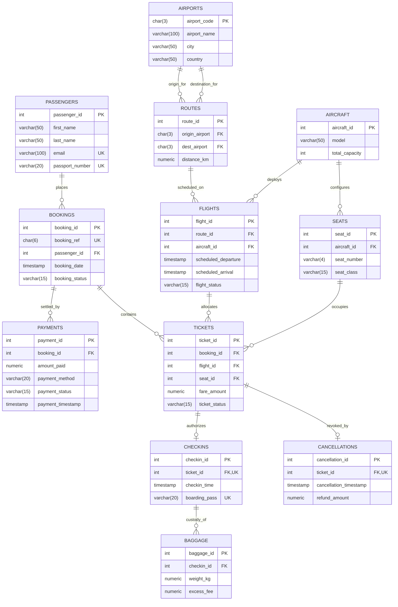

# Entity-Relationship (ER) Architecture & Relational Topology

## 1. System Overview & Conceptual Model

The **Airline Reservation and Flight Operations Management System (ARFOM-DB)** models the end-to-end operational and commercial lifecycle of an enterprise airline. It establishes relational integrity across flight planning, physical airframe topology, dynamic seat allocations, passenger identity, bookings, financial settlements, departure control (check-in/baggage), and cancellation audits.

The database model is strictly decomposed to **Third Normal Form (3NF)** and enforces all physical airframe and commercial business rules at the database engine level.

---

## 2. Complete Entity-Relationship (ER) Diagram

---

## 3. Structural Cardinalities & Relationship Mechanics

| Parent Entity | Child Entity | Relationship Cardinality | Participation | Relational Integrity Rule |
| :--- | :--- | :--- | :--- | :--- |
| **`airports`** | **`routes`** (Origin) | $1 : N$ (One-to-Many) | Mandatory | An airport can originate many flight corridors; a route must have exactly 1 origin airport (`ON DELETE RESTRICT`). |
| **`airports`** | **`routes`** (Dest) | $1 : N$ (One-to-Many) | Mandatory | An airport can terminate many corridors; a route must have exactly 1 destination airport (`ON DELETE RESTRICT`). `CHECK (origin <> dest)`. |
| **`routes`** | **`flights`** | $1 : N$ (One-to-Many) | Mandatory | A route corridor hosts recurring flight instances; each flight maps to exactly 1 defined route. |
| **`aircraft`** | **`seats`** | $1 : N$ (One-to-Many) | Mandatory | An airframe physically holds multiple seats. If an airframe is decommissioned, its seat topography cascades (`ON DELETE CASCADE`). |
| **`aircraft`** | **`flights`** | $1 : N$ (One-to-Many) | Mandatory | An aircraft is deployed across multiple scheduled flight legs; each flight leg requires 1 active airframe. |
| **`passengers`** | **`bookings`** | $1 : N$ (One-to-Many) | Optional | A customer account can place multiple commercial bookings over time. |
| **`bookings`** | **`tickets`** | $1 : N$ (One-to-Many) | Mandatory | A commercial booking order contains 1 or more passenger flight segment tickets (`ON DELETE CASCADE`). |
| **`bookings`** | **`payments`** | $1 : N$ (One-to-Many) | Mandatory | A booking transaction can be settled across 1 or more payment attempts/methods. |
| **`flights`** | **`tickets`** | $1 : N$ (One-to-Many) | Mandatory | A flight inventory contains multiple issued tickets up to its airframe capacity limit. |
| **`seats`** | **`tickets`** | $1 : N$ (One-to-Many) | Mandatory | A physical seat is allocated across distinct flights. Enforced unique constraint: `UNIQUE (flight_id, seat_id)`. |
| **`tickets`** | **`checkins`** | $1 : 1$ (One-to-One) | Optional | An active issued ticket produces at most **one** airport check-in and boarding pass token (`ticket_id UNIQUE`). |
| **`checkins`** | **`baggage`** | $1 : N$ (One-to-Many) | Optional | A checked-in passenger can register 0, 1, or multiple checked baggage items. |
| **`tickets`** | **`cancellations`** | $1 : 1$ (One-to-One) | Optional | A ticket can be revoked at most **once** (`ticket_id UNIQUE`). |

---

## 4. Key Relational Invariants Enforced in Topology

1. **Airframe Topology Decoupling**: Seats are bound to physical airframes (`aircraft_id`), not directly to flights. This allows an airline to change the physical aircraft deployed on a flight without redesigning seat maps.
2. **Double-Booking Prevention**: The composite constraint `UNIQUE (flight_id, seat_id)` physically prevents any seat on a flight from having more than one valid ticket allocated.
3. **Audit Ledger Immutability**: `payments`, `checkins`, and `cancellations` preserve permanent transactional historical states, satisfying financial and regulatory auditability.
